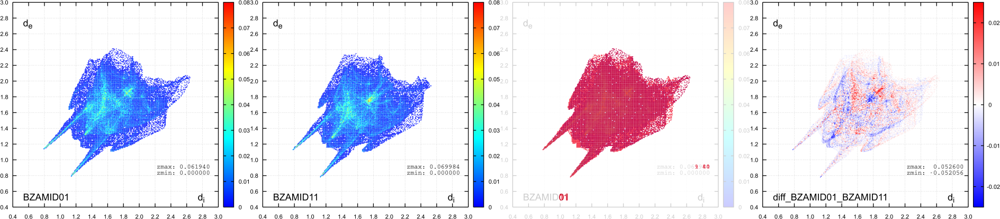
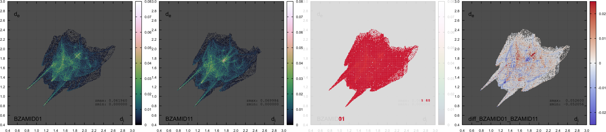

# Background

The electronic interaction of a molecule with its neighbors in the
crystalline state may be described by the Hirshfeld
surface[^1]<sup>,</sup> [^2]<sup>,</sup> [^3] accessible by
CrystalExplorer.[^4] This 3D surface may be projected as a normalized 2D
fingerprint map.[^5]

To identify similarities and differences among crystallographic models
with greater ease, Carter[^6] suggest the inspection of *difference
maps* of these normalized 2D fingerprint maps. This extends the
qualitative, visual comparison of the maps *as images*, e.g. with
ImageMagick's `compare` instruction,[^7] by a computed comparison of
normalized fingerprint map data where differences are quantified
locally. Summing up any information in each difference map eventually
may condense the analysis to a *difference number*. The figure below
illustrates the comparison of two polymorphs of benzamide.

<figure id="alignment" width="75%">

<figcaption>Normalized 2D fingerprint maps of Hirshfeld surfaces for
CCDC model BZAMID01 and BZAMID11 (left and left center) about benzamide.
Both fingerprints are derived from the analysis by CrystalExplorer at
<em>very high</em> resolution (<span
class="math inline"><em>d</em><sub><em>i</em></sub></span> and <span
class="math inline"><em>d</em><sub><em>e</em></sub></span> in the
extended map range of 0.40–3.00 Å, with a 0.01 Å increment each).
Qualitative difference assignment by superposition provided by
ImageMagick (right center); each red pixel indicates <em>any</em>
difference between the two images inspected. Quantitative spatial
information provided by the <em>computed difference map</em> with the
scripts of this repository (right).</figcaption>
</figure>

# workflow

## setup of CrystalExplorer

*Prior* to this analysis, the Hirshfeld surface needs to be computed by
CrystalExplorer.[^8] By default, the information required here is stored
in intermediate `.cxs` files. To retain these data, open CrystalExplorer
and access the "expert tab" in the menu accessible *via* `File` →
`Preferences`. Disable the check mark next to "remove working files".
(This change will remain active – even if CrystalExplorer is relaunched
– until you intentionally revert the options by clicking on "Restore
Expert Settings".)

Equally note, computations in CrystalExplorer preparing the difference
fingerprint analysis require the *very high* level of resolution. This
is one level above the one CrystalExplorer suggests you by default, just
prior to its computation.

## subsequent processing of CrystalExplorer's data, default

To normalize the fingerprint map, compile the Fortran `fingerprint.f90`
e.g., with gfortran.[^9] In the subsequent use, indicate if the output
should cover standard (0.4 - 2.6), translated (0.8 - 3.0), or extended
range (0.4 - 3.0 A), e.g.

``` shell
gfortran fingerprint.f90 -o fingerprint
./fingerprint input.cxs [standard | translated | extended] output.dat
```

For the computation of the difference map, compile the C code e.g., with
gcc.[^10] Ensure to submit exactly two normalized maps of same dimension
(for instance, both extended range), e.g.

``` shell
gcc diff_finger.c -o diff_finger
./diff_finger input_A.dat input_B.dat > difference.dat
```

The difference between two normalized maps can be summed up with a
script written in Ruby.[^11] Run e.g.,

``` shell
$ ruby ./sum_abs_diffs.rb diff_BZAMID01_BZAMID11.dat 
diff_BZAMID01_BZAMID11.dat  61.4040
```

## additions to the original code

To familiarize with the approach, sub folder `testdata` contains .cif,
DataWarrior's .cxs as well as results of the above processing for two
structure models, `BZAMID01` and `BZAMID11`.

Sub folder `incubator` contains source code added after the publication
by Carter *et al.* This is to provide e.g., a mean to compute the
difference map and calculate the difference number with Fortran alone.

Sub folder `plot2gnuplot` contains a couple of bash scripts to invoke
gnuplot[^12] to visualize the results either as bitmap (png format), or
vector graphics (pdf). For details, see its separate documentation.

The figures below illustrate the visual output using defaults (first
row), or with optional parameters (second row). Each row depicts two
normalized fingerprints either compared with ImageMagick's `compare`, or
as a computed difference map. The lower row illustrates usage of an
optional non-white background as well as an optional color map
considered "safer" for visual inspection than gnuplot's `jet` (because
of perceptual uniformity with monotonically increasing luminance).




[^1]: Spackman, M. A.; Byrom, P. G. A Novel Definition of a Molecule in
    a Crystal. *Chem. Phys. Lett.* **1997**, *267*, 215–220. [doi
    10.1016/S0009-2614(97)00100-0](https://doi.org/10.1016/S0009-2614(97)00100-0).

[^2]: McKinnon, J. J.; Spackman, M. A.; Mitchell, A. S. Novel Tools for
    Visualizing and Exploring Intermolecular Interactions in Molecular
    Crystals. *Acta Cryst B Struct Sci* **2004**, *60*, 627–668. [doi
    10.1107/S0108768104020300](https://doi.org/10.1107/S0108768104020300)

[^3]: [*The Hirshfeld
    Surface*](https://crystalexplorer.net/docs/manual/isosurfaces/hirshfeld-surface/)
    at CrystalExplorer's project page.

[^4]: CrystalExplorer is distributed by the University of Western
    Australia at <https://crystalexplorer.net/>.

[^5]: Spackman, M. A.; McKinnon, J. J. Fingerprinting Intermolecular
    Interactions in Molecular Crystals. *CrystEngComm* ****2002****,
    *4*, 378–392. [doi
    10.1039/B203191B](https://doi.org/10.1039/B203191B)

[^6]: Carter, D. J.; Raiteri, P.; Barnard, K. R.; Gielink, R.; Mocerino,
    M.; Skelton, B. W.; Vaughan, J. G.; Ogden, M. I.; Rohl, A. L.
    Difference Hirshfeld Fingerprint Plots: A Tool for Studying
    Polymorphs. *CrystEngComm* **2017**, *19*, 2207–2215. [doi
    10.1039/C6CE02535H](https://doi.org/10.1039/C6CE02535H)

[^7]: For further documentation about the program suite, see
    <https://imagemagick.org/> An instruction in line of `compare
    image_A.png image_B.png difference_A_B.png` tests `image_A.png`
    against `image_B.png` of same file dimension. It reports identified
    dissimilarities by a red pixel in the newly written file
    `difference_A_B.png`. For additional information about the image
    comparison, see <https://imagemagick.org/script/compare.php>.

[^8]: CrystalExplorer is distributed by the University of Western
    Australia at <https://crystalexplorer.net/>.

[^9]: See for instance
    <https://fortran-lang.org/learn/os_setup/install_gfortran/>

[^10]: For further information, see <https://gcc.gnu.org/>.

[^11]: For further information, see <https://www.ruby-lang.org/en/>.

[^12]: For further documentation, see <http://gnuplot.info/>.
