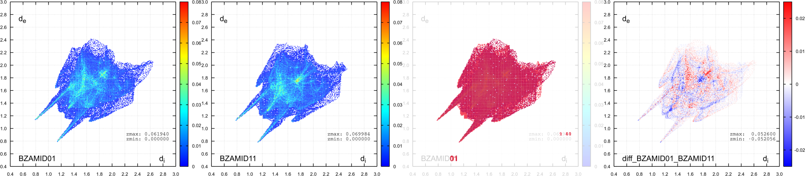
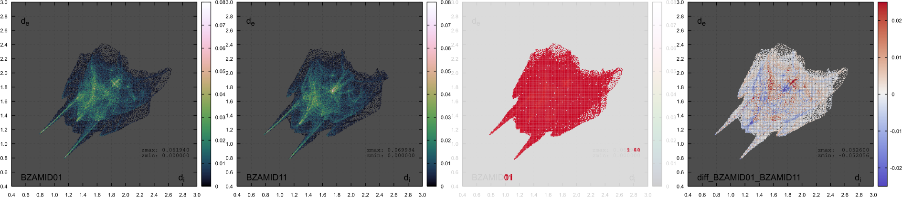
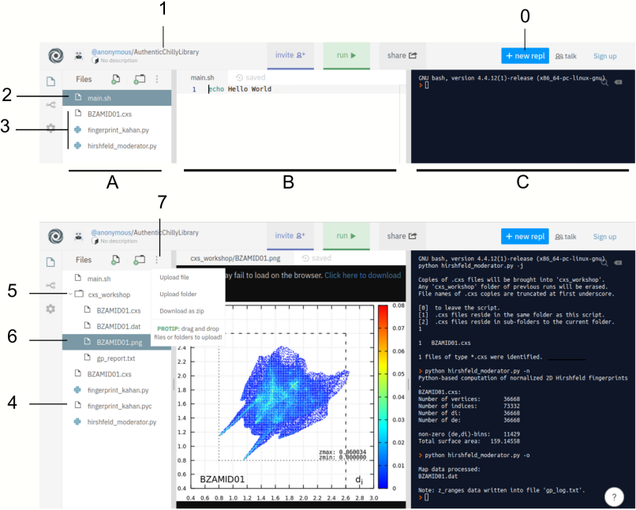

# Background

The electronic interaction of a molecule with its neighbors in the
crystalline state may be described by the Hirshfeld
surface,<a id="fnr.1" class="footref" href="#fn.1">1</a> accessible by
CrystalExplorer.<a id="fnr.2" class="footref" href="#fn.2">2</a> This 3D surface may be
projected as a normalized 2D fingerprint map.<a id="fnr.3" class="footref" href="#fn.3">3</a>

To identify similarities and differences among crystallographic
models with greater ease, Carter *et al.*<a id="fnr.4" class="footref" href="#fn.4">4</a> suggest
the inspection of *difference maps* of these normalized 2D
fingerprint maps.  This extends the qualitative, visual comparison
of the maps *as images*, e.g. with ImageMagick's `compare`
instruction,<a id="fnr.5" class="footref" href="#fn.5">5</a> by a computed comparison of
normalized fingerprint map data where differences are quantified
locally.  Summing up any information in each difference map
eventually may condense the analysis to a *difference number*.  The
figure below illustrates the comparison of two polymorphs of
benzamide.

 about benzamide.  Both fingerprints are derived from the analysis by CrystalExplorer at *very high* resolution (\(d_i\) and \(d_e\) in the extended map range of 0.40&#x2013;3.00 &Aring;, with a 0.01 &Aring; increment each).  Qualitative difference assignment by superposition  provided by ImageMagick (right center); each red pixel indicates *any* difference between the two images inspected.  Quantitative spatial information provided by the *computed difference map* with the scripts of this repository (right).")

To popularize this type of analysis, this fork aims to ease access
to the underlying methods.  Python is used to provide the interested
eventually a portable, unified interface to work from the command
line.

# Preparation

*Prior* to this analysis, the Hirshfeld surface needs to be computed
by CrystalExplorer.<a id="fnr.2.100" class="footref" href="#fn.2">2</a> By default, the information
required here is stored in intermediate `.cxs` files.  To retain
these data, open CrystalExplorer and access the "expert tab" in the
menu accessible *via* `File` &rarr; `Preferences`.  Disable the
check mark next to "remove working files".  (This change will remain
active &#x2013; even if CrystalExplorer is relaunched &#x2013; until you
intentionally revert the options by clicking on "Restore Expert
Settings".)

Equally note, computations in CrystalExplorer preparing the
difference fingerprint analysis require the *very high* level of
resolution.  This is one level above the one CrystalExplorer
suggests you by default, just prior to its computation.

For the *moderated difference fingerprint analysis* scripts
`hirshfeld_moderator.py` and assisting `fingerprint_kahan.py` need
to be both in the folder with `.cxs` files to work with.
Alternatively, the `.cxs` files of interest should be stored in
sub-folders just one level below these two scripts.  Prioritizing
the portability of the computational part of the analysis over the
speed of execution, both scripts are written to perform the analysis
exclusively with either standard Python 3,<a id="fnr.6" class="footref" href="#fn.6">6</a> legacy
Python 2.7.17, or the recommended faster processing pypy<a id="fnr.7" class="footref" href="#fn.7">7</a>
alone.  If you may not install Python on the computer you are
working, consider alternatives like WinPython<a id="fnr.8" class="footref" href="#fn.8">8</a> (which
may run from a USB-thumbrive) or an installation-free session on
<https://repl.it>.<a id="fnr.9" class="footref" href="#fn.9">9</a>

The moderator script equally offers an unified interface to perform
some or all computations with the code published by Andrew Rohl and
Paolo Raiteri.  To relay the tasks successfully, copy the additional
files (`fingerprint.f90`, `diff_finger.c`, and `sum_abs_diff.rb`)
into the same folder as the moderator script.  Note that this
approach equally requires a callable installation of a compiler for
Fortran and C (`gcc`)<a id="fnr.10" class="footref" href="#fn.10">10</a> and Ruby.<a id="fnr.11" class="footref" href="#fn.11">11</a>

The figures below illustrate the visual output using defaults (first
row), or with optional parameters (second row).  Each row depicts two
normalized fingerprints either compared with ImageMagick's `compare`,
or as a computed difference map.

# Basic use, local computer

This approach prioritizes the portability of the analysis. By
consequence, computations by scripts `moderator_hirshfeld.py` and
`fingerprint_kahan.py` are set up to interact well with either
Python 3,<a id="fnr.6.100" class="footref" href="#fn.6">6</a> legacy Python 2, or pypy.<a id="fnr.7.100" class="footref" href="#fn.7">7</a> It requires
at least *both* `hirshfeld_moderator.py` and `fingerprint_kahan.py`
to access CrystalExplorer's `.cxs` files from the same folder.

-   To prepare the analysis, consider the following instructions from
    the CLI:
    
        python hirshfeld_moderator.py -h   # access the script's help menu
        python hirshfeld_moderator.py -l   # list the .cxs accessible
        python hirshfeld_moderator.py -j   # join copies of .cxs to cxs_workshop folder

-   Subsequently, the recommended consecution of computations is the
    following:
    
        python hirshfeld_moderator.py -n   # generate normalized fingerprints
        python hirshfeld_moderator.py -c   # compare normalized fingerprints
        python hirshfeld_moderator.py -r   # compute the difference number
    
    Because of the computational demand of these computations, the use
    of pypy<a id="fnr.7.100" class="footref" href="#fn.7">7</a> *instead* of default Python is recommend if
    opting for an analysis with Python-only.  On the CLI, this only
    substitutes `python` by `pypy`, e.g.
    
        pypy hirshfeld_moderator.py -n   # generate normalized fingerprints

-   It is possible to use the moderator script to interact with the
    original scripts as well.  Only then these additional files
    (`fingerprint.f90`, `diff_finger.c`, `sum_abs_diffs.rb`) should
    equally be pasted into the same folder as the moderator script.
    Beside Python, this approach equally requires the callable
    installation of a compiler like gcc<a id="fnr.10.100" class="footref" href="#fn.10">10</a> and Ruby.<a id="fnr.11.100" class="footref" href="#fn.11">11</a>
    
    After preparing the data as above, a call with the upper-case
    variants of the parameters then relays the work to the compiled
    languages instead:
    
        python hirshfeld_moderator.py -N   # generate normalized fingerprints (Fortran)
        python hirshfeld_moderator.py -C   # compare normalized fingerprints (C)
        python hirshfeld_moderator.py -R   # compute the difference number (Ruby)

-   In presence of an installation of `gnuplot`, or Python's
    `matplotlib`, a rapid *overview* of the results may be generated.
    As outlined further in the manual, these `.png` images help to
    adjust parameters for subsequent images of higher quality:
    
        python hirshfeld_moderator -o   # relay to gnuplot
        python hirshfeld_moderator -O   # relay to Python matplotlib
    
    Note that the second path with `matplotlib` is assisted by the
    `numpy`, both modules which are not part of the Python standard
    library.  These may require additional installation (e.g., with
    `pip`).  Note that *both* visualization approaches, as well as
    performing the analysis with Python, are known to work without
    installation in a `bash` session on repl.it.

Further details how to use the moderator script (e.g., plotting the
maps in higher quality, export as `.pdf` file, adjustment of map
range) or how to access the code by Andrew Rohl and Paolo Raiteri
directly are described in the documentation.

# Basic use, remote instance on repl.it

The computation of normalized 2D Hirshfeld surface fingerprints and
difference maps may be performed remotely on repl.it<a id="fnr.9.100" class="footref" href="#fn.9">9</a>
which offers Linux-Ubuntu instance already meeting the requirements
for this analysis.  On this site, the button "start coding" opens a
pull down menu, choose here `bash` among the languages and confirm
this choice with "Create Repl".  After a few moments, the interface
changes into a window similar to the one in the upper section of the
next image.

At any time, a new session may be started from scratch with the
button "new repl" (0), which is named randomly (1).  The left of the
three columns (A) is the remote repository of any files to work with
or about files which were created.  Additional files (e.g., `.cxs`
files and code scripts) may be imported into (A) by
drag-and-drop as shown (3).  By default, the `bash` profile is initialized
with the script `main.sh` (2) whose content is displayed in the
central editor pane (B).  The right hand column (C) is the Linux
Ubuntu-backed terminal running `bash`, awaiting your instructions.

The lower section of the figure displays the situation after a
minimal analysis by

    python hirshfeld_moderator.py -j  # join .cxs copies in a workshop directory
    python hirshfeld_moderator.py -n  # compute normalized 2D fingerprints
    python hirshfeld_moderator.py -o  # generate survey plots with gnuplot

File `fingerprint_kahan.pyc` (4) is not of further interest for the
analysis.  As expected, the moderator created folder `cxs_workshop`
(5) contains the copied `BZAMID01.cxs` file, the normalized 2D
Hirshfeld surface fingerprint (`BZAMID01.dat`), the `gnuplot`-based
plot of this map, `BZAMID01.png` (6), and the logging
`gp_report.txt` (see documentation).  The center pane (B) is capable
to display the `.png` image if the corresponding file was
marked (6).  A click on the three vertical dots (7) provides a mean
to retrieve all data for local storage.

At present (April 2020), the `bash` profile on `repl.it` offers
access to Python 3 and legacy Python 2.7.17 to perform the
computations, and with `gnuplot` and Python's `numpy` and
`matplotlib` the tools to visualize the results in either `.png`, or
`.pdf`.  With `gcc` and `Ruby`, the scripts by Andrew Rohl and Paolo
Raiteri may equally be used here directly as outlined in the
documentation.

# Footnotes

<a id="fn.1" href="#fnr.1">1</a> a) "A novel definition of a molecule in a
crystal", Spackman, M. A.; Byrom, P. G. in Chem. Phys. Lett., 1997,
267, 215&#x2013;220, doi: [10.1016/S0009-2614(97)00100-0](https://www.sciencedirect.com/science/article/pii/S0009261497001000?via%3Dihub). b) "Novel tools for
visualizing and exploring intermolecular interactions in molecular
crystals", McKinnon, J. J.; Spackman, M. A.; Mitchell, A. S. in Acta
Cryst. B, 2004, 60, 627&#x2013; 668, doi: [10.1107/S0108768104020300](http://scripts.iucr.org/cgi-bin/paper?S0108768104020300). c)
<http://130.95.176.70/wiki/index.php/The_Hirshfeld_Surface>

<a id="fn.2" href="#fnr.2">2</a> CrystalExplorer is distributed by the University
of Western Australia at <http://crystalexplorer.scb.uwa.edu.au/>.

<a id="fn.3" href="#fnr.3">3</a> "Fingerprinting Intermolecular Interactions in
Molecular Crystals", Spackman, M. A.; McKinnon, J. J. in CrystEngComm,
2002, 4, 378&#x2013;392, doi: [10.1039/B203191B](https://pubs.rsc.org/en/content/articlelanding/2002/ce/b203191b#!divAbstract).

<a id="fn.4" href="#fnr.4">4</a> "Difference Hirshfeld fingerprint plots: a tool for
studying polymorphs." Carter, D. J.; Raiteri, P.; Barnard, K. R.;
Gielink, R.; Mocerino, M.; Skelton, B. W.; Vaughan, J. G.; Ogden,
M. I.; Rohl, A. L. in CrystEngComm, 2017, 19, 2207&#x2013;2215, doi:
[10.1039/c6ce02535h](https://pubs.rsc.org/en/content/articlelanding/2017/ce/c6ce02535h#!divAbstract).

<a id="fn.5" href="#fnr.5">5</a> For further documentation about the program
suite, see <https://imagemagick.org/> An instruction in line of `compare
image_A.png image_B.png difference_A_B.png` tests `image_A.png`
against `image_B.png` of same file dimension.  It reports identified
dissimilarities by a red pixel in the newly written file
`difference_A_B.png`.  For additional information about the image
comparison, see <https://imagemagick.org/script/compare.php>.

<a id="fn.6" href="#fnr.6">6</a> See, for example, <https://www.python.org/>.

<a id="fn.7" href="#fnr.7">7</a> For further information, see <https://www.pypy.org/>.

<a id="fn.8" href="#fnr.8">8</a> For further documentation, see
<https://winpython.github.io/>. This highly flexible approach for
"Python on the go" for Windows does not require an installation.  It
already includes the two non-standard modules NumPy and Matplotlib
mentioned and hence allows *both* the computation along the
"Python-only" path *and* the visualization of the results as `.png`
and `.pdf`.

<a id="fn.9" href="#fnr.9">9</a> Entry page at <https://repl.it/>.

<a id="fn.10" href="#fnr.10">10</a> For further information, see <https://gcc.gnu.org/>.

<a id="fn.11" href="#fnr.11">11</a> For further information, see <https://www.ruby-lang.org/en/>.
