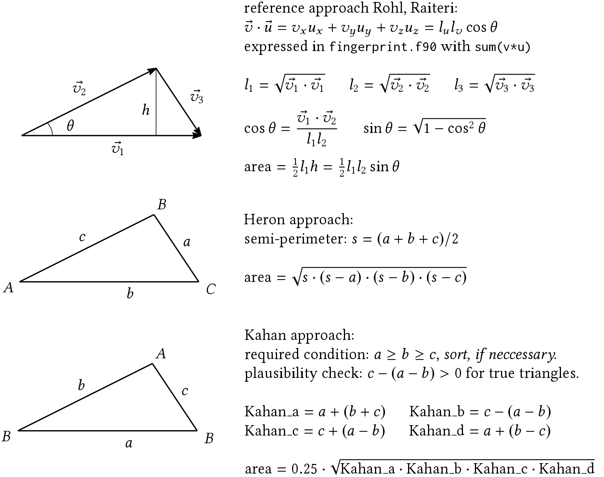

# Background

The electronic interaction of a molecule with its neighbors in the
crystalline state may be described by the Hirshfeld
surface,<a id="fnr.1" class="footref" href="#fn.1">1</a> accessible by
CrystalExplorer.<a id="fnr.2" class="footref" href="#fn.2">2</a> This 3D surface may be
projected as a normalized 2D fingerprint map.<a id="fnr.3" class="footref" href="#fn.3">3</a>

To identify similarities and differences among crystallographic
models with greater ease, Carter *et al.*<a id="fnr.4" class="footref" href="#fn.4">4</a> suggest
the inspection of *difference maps* of these normalized 2D
fingerprint maps.  This extends the qualitative, visual comparison
of the maps *as images*, e.g. with ImageMagick's `compare`
instruction,<a id="fnr.5" class="footref" href="#fn.5">5</a> by a computed comparison of
normalized fingerprint map data where differences are quantified
locally.  Summing up any information in each difference map
eventually may condense the analysis to a *difference number*.  The
figure below illustrates the comparison of two polymorphs of
benzamide.

 about benzamide.  Both fingerprints are derived from the analysis by CrystalExplorer at *very high* resolution (\(d_i\) and \(d_e\) in the extended map range of 0.40&#x2013;3.00 &Aring;, with a 0.01 &Aring; increment each).  Qualitative difference assignment by superposition  provided by ImageMagick (right center); each red pixel indicates *any* difference between the two images inspected.  Quantitative spatial information provided by the *computed difference map* with the scripts of this repository (right).")

To popularize this type of analysis, this fork aims to ease access
to the underlying methods.  Python is used to provide the interested
eventually a portable, unified interface to work from the command
line.

# Preparation

*Prior* to this analysis, the Hirshfeld surface needs to be computed
by CrystalExplorer.<a id="fnr.2.100" class="footref" href="#fn.2">2</a> By default, the information
required here is stored in intermediate `.cxs` files.  To retain
these data, open CrystalExplorer and access the "expert tab" in the
menu accessible *via* `File` &rarr; `Preferences`.  Disable the
check mark next to "remove working files".  (This change will remain
active &#x2013; even if CrystalExplorer is relaunched &#x2013; until you
intentionally revert the options by clicking on "Restore Expert
Settings".)

Equally note, computations in CrystalExplorer preparing the
difference fingerprint analysis require the *very high* level of
resolution.  This is one level above the one CrystalExplorer
suggests you by default, just prior to its computation.

For the *moderated difference fingerprint analysis* scripts
`hirshfeld_moderator.py` and assisting `fingerprint_kahan.py` need
to be both in the folder with `.cxs` files to work with.
Alternatively, the `.cxs` files of interest should be stored in
sub-folders just one level below these two scripts.  Prioritizing
the portability of the computational part of the analysis over the
speed of execution, both scripts are written to perform the analysis
exclusively with either standard Python 3,<a id="fnr.6" class="footref" href="#fn.6">6</a> legacy
Python 2.7.17, or the recommended faster processing pypy<a id="fnr.7" class="footref" href="#fn.7">7</a>
alone.

The moderator script equally offers an unified interface to perform
some or all computations with the code published by Andrew Rohl and
Paolo Raiteri.  To relay the tasks successfully, copy the additional
files (`fingerprint.f90`, `diff_finger.c`, and `sum_abs_diff.rb`)
into the same folder as the moderator script.  Note that this
approach equally requires a callable installation of a compiler for
Fortran and C (`gcc`)<a id="fnr.8" class="footref" href="#fn.8">8</a> and Ruby.<a id="fnr.9" class="footref" href="#fn.9">9</a>

Next, this documentation outlines

-   a moderated analysis of the `.cxs` data with
    `hirshfeld_moderator.py` and its assistant,
    `fingerprint_kahan.py`.  Each step will be performed by standard
    modules a default Python installation already includes.
-   a moderated analysis of the `.cxs` data with
    `hirshfeld_moderator.py` relaying work to `fingerprint.f90`,
    `diff_finger.c` and `sum_abs_diff.rb` by Andrew Rohl and Paolo
    Raiteri
-   an analysis accessing the three scripts by Andrew Rohl and Paolo
    Raiteri directly, without use of the moderator script.
-   two options to visualize the computed fingerprints / difference
    maps with either `gnuplot`,<a id="fnr.10" class="footref" href="#fn.10">10</a> or Python's `matplotlib`
    library<a id="fnr.11" class="footref" href="#fn.11">11</a> from the moderator script.  Because both
    the normalized fingerprints, as well as the difference maps are
    written into plain ASCII `.dat` files, you equally may use any
    other application of your preference to visualize these results.

## Moderated interaction, Python-only approach

This approach prioritizes the portability of the analysis over the
rate of computation.  Both script `moderator_hirshfeld.py` and
assisting `fingerprint_kahan.py` are set up to interact well with
either Python 3,<a id="fnr.6.100" class="footref" href="#fn.6">6</a> legacy Python 2, or pypy.<a id="fnr.7.100" class="footref" href="#fn.7">7</a> This
approach requires *both* Python scripts to access CrystalExplorer's
`.cxs` files from the same folder which either a) contains the
`.cxs` files of interest, or b) contains the `.cxs` files in direct
sub-folders to the two scripts.

Because the computation exclusively relies on Python, this approach
is well suitable for a portable use (e.g., in
WinPython,<a id="fnr.12" class="footref" href="#fn.12">12</a> run from a USB thumb-drive) or a
completely installation free instance like on
<https://repl.it>.<a id="fnr.13" class="footref" href="#fn.13">13</a>

-   To prepare the analysis, consider the following instructions from
    the CLI (in-line comments you not type are preceded by the `#`
    sign):
    
        python hirshfeld_moderator.py -h  # access the script's help menu
        python hirshfeld_moderator.py -l  # list the .cxs accessible
        python hirshfeld_moderator.py -j  # join copies of .cxs to cxs_workshop
    
    This sequence constrains the analysis to *copies* of the `.cxs`
    files which the moderator script puts in a newly created folder,
    `cxs_workshop`. It takes into account that CrystalExplorer's
    results reading a `.cif` (e.g., `example.cif`) are stored in a
    `.cxs` file named `example_example.cxs`; to ease future file
    management, the file names *of copied* `.cxs` files are truncated
    at their first underscore (`example.cxs`).

-   Subsequently, proceed the computations in the following sequence:
    
        python hirshfeld_moderator.py -n  # generate normalized fingerprints
        python hirshfeld moderator.py -c  # compare normalized fingerprints
        python hirshfeld_moderator.py -r  # compute the difference number 
    
    Especially the computation of fingerprints and difference maps
    are demanding for the number of individual computations required
    *per file*.  Thus, it is highly recommended to deploy the
    eventually faster working pypy<a id="fnr.7.100" class="footref" href="#fn.7">7</a> *instead* of default
    Python with the instructions
    
        pypy hirshfeld_moderator.py -n  # generate normalized fingerprints
        pypy hirshfeld moderator.py -c  # compare normalized fingerprints
        pypy hirshfeld_moderator.py -r  # compute the difference number 
    
    A significant increase in performance using pypy instead of
    default Python may be noticed while working with larger sets of
    data.  This is because, contrasting to the default Python
    interpreter, pypy internally generates a compiled executable of
    the script.

Note that the Python-based approach computation of 2D normalized
fingerprints of the Hirshfeld surfaces relays the task to
`fingerprint_kahan.py`, called on time by `moderator_hirshfeld.py`.
For each Hirshfeld surface recorded in a `.cxs` file, the areas of
thousands of individual triangles are computed and their
contribution to the Hirshfeld surface is normalized.  Contrasting
to the trigonometric approach in `fingerprint.f90`, the scope of
triangles considered by assistant script `fingerprint_kahan.py` is
wider and hence implemented as default here.<a id="fnr.14" class="footref" href="#fn.14">14</a>

The moderator script identifies all relevant `.cxs` or `.dat` files
in folder `cxs_workshop`.  A copied Hirshfeld surface file
`input.cxs` will yield a normalized 2D fingerprint written into
`output.dat`.  Two normalized fingerprint files `inputA.dat` and
`inputB.dat` will yield one difference map,
`diff_inputA_inputB.dat` if the moderator script recognizes both
fingerprint maps to cover the same map range.

The analysis with the moderator script *always* yields normalized
fingerprint maps covering the extended map range (0.40&#x2013;3.00 &Aring;).
Postponing the explicit choice of a map range to the stage of
visualization is beneficial to a synoptic analysis.

## Moderated interaction, non-Python scripts

The project includes `fingerprint.f90`, `diff_finger.c`, and
`sum_abs_diffs.rb` by Andrew Rohl and Paolo Raiteri, forked from
their original repository.<a id="fnr.15" class="footref" href="#fn.15">15</a> In presence of a callable
installation of `gcc` and Ruby, the Python script
`hirshfeld_moderator.py` launches their compilation, and works with
their executables and the `.cxs` / `.dat` files.

The recommended sequence to access the help menu, listing and
eventually joining copies of the `.cxs` files provided by
CrystalExplorer is the following:

    python hirshfeld_moderator.py -l  # list the .cxs accessible
    python hirshfeld_moderator.py -h  # access the script's help menu
    python hirshfeld_moderator.py -j  # join copies of .cxs to cxs_workshop

Then, trigger the actions of the non-Python code by the instructions of

    python hirshfeld_moderator.py -N  # generate normalized fingerprints (Fortran)
    python hirshfeld_moderator.py -C  # compare normalized fingerprints (C)
    python hirshfeld_moderator.py -R  # compute difference number (Ruby)

Aiming an exhaustive analysis, the moderator script will again
identify the necessary `.cxs` or `.dat` files in folder
`cxs_workshop`.  The processing with the compiled Fortran and C
code is much faster than their corresponding Python analogues
deployed with standard Python 3,<a id="fnr.16" class="footref" href="#fn.16">16</a> and still about 25%
faster than using pypy.

The analysis with the moderator script *always* yields normalized
fingerprint maps covering the extended map range (0.40&#x2013;3.00 &Aring;).
Postponing the explicit choice of a map range to the stage of
visualization is beneficial to a synoptic analysis.

## Direct interaction with the non-Python scripts

The programs `fingerprint.f90`, `diff_finger.c`, and
`sum_abs_diffs.rb` forked<a id="fnr.15.100" class="footref" href="#fn.15">15</a> are retained for a direct
interaction without a moderator script.  This approach requires
*both* their presence in the same folder as the `.cxs` or `.dat`
files to work with *and* a callable installation of the
corresponding compilers.  The recommended sequence of computation
is the following:

-   To compute a 2D normalized fingerprint of a Hirshfeld surface,
    calling a Fortran compiler like `gcc` generates an executable:
    
        1  gcc fingerprint.f90 -o fingerprint.x
    
    The syntax to trigger this executable's action depends on the
    operating system.  With CrystalExplorer's intermediate results
    stored e.g., in `input.cxs`, the command on Linux' terminal
    follows the pattern of
    
        2  ./fingerprint.x input.cxs [standard | translated | extended] output.dat
    
    to yield a normalized fingerprint map (`output.dat`).  Note,
    there is no default map range defined; it is mandatory to define
    explicitly by either one of the three keywords if the result
    shall cover either the `standard` (0.40&#x2013;2.60 &Aring;), `translated`
    (0.60&#x2013;3.00 &Aring;), or `extended` (0.40&#x2013;3.00 &Aring;) map range.  You
    may define any file name other than `output.dat` for the
    permanent record written, too.
    
    In Windows' command prompt (`cmd.exe`), the leading `./` is
    dropped.  Thus, the pattern of instruction is
    
        3  fingerprint.x input.cxs [standard | translated | extended] output.dat
    
    Freely available alternatives to `gcc` proven to compile
    `fingerprint.f90` successfully include `gfortran`<a id="fnr.17" class="footref" href="#fn.17">17</a>
    and `g95`.<a id="fnr.18" class="footref" href="#fn.18">18</a>

-   After compilation of `diff_finger.c`, two normalized 2D
    fingerprint map files serve as input to compute a difference map.
    Without use of the moderator script, it is up to you to ensure
    both fingerprints cover the same map range, i.e. *both* cover
    either standard, translated, or expanded map range.
    
        4  # Linux approach:
        5  gcc diff_finger.c -o diff_finger
        6  ./diff_finger input_A.dat input_B.dat > difference.dat
        7  # Windows approach:
        8  gcc diff_finger.c -o diff_finger.exe
        9  diff_finger.exe input_A.dat input_B.dat > difference.dat
    
    For an analysis performed in Windows, do not forget the explicit
    definition of the `.exe` file extension for the compiled
    executable.  This executable however is not a self sufficient
    program you can use on other Windows computers than the one just
    used for the compilation.

-   To sum up the absolute differences in a difference map, identify
    the `*.dat` file in question.  With a callable installation of
    Ruby, the instruction for either Linux or Windows of
    
        10  ruby sum_abs_diffs.rb difference.dat
    
    will print the difference number about file `difference.dat` to
    the terminal.  The greater the absolute differences identified,
    the greater the difference number which always will be a positive
    real number, or zero.

## Visualization of the results

Script `fingerprint_moderator.py` provides an interface to
visualize the results of the previous computations stored in the
`.dat` files with `gnuplot`,<a id="fnr.10.100" class="footref" href="#fn.10">10</a> or Python's
`matplotlib`.<a id="fnr.11.100" class="footref" href="#fn.11">11</a> Note, normalized fingerprints and
their difference maps still may be computed should `gnuplot` or /
and Python's `matplotlib` be inaccessible to the moderator script.
Because both normalized fingerprint maps, as well as difference
maps are saved as plain ASCII `.dat` files, you may use any other
program of your preference to visualize the results, too.

The command keywords for either one of the two approaches differ
only by starting with either a lower case character (relay to
`gnuplot`), or an upper case character (Python `matplotlib`).  The
recommended sequence is

-   to survey quickly the fingerprints and difference maps, by either
    
        1  python hirshfeld_moderator -o  # gnuplot instance
        2  python hirshfeld_moderator -O  # matplotlib instance
    
    The generated bitmap `.png`, intentionally kept at small
    dimension, provide *an overview* about fingerprints and
    difference maps accessible.  Plot about the *extended map range*
    (0.40&#x2013;3.00 &Aring;), dashed lines indicate the upper limits of the
    *standard map range* (0.40&#x2013;2.60 &Aring;, lower left).  Dotted lines
    indicate the lower limits of the *translated map range*
    (0.80&#x2013;3.00 &Aring;, upper right).  These indicators assist in the
    selection of a map range in common for a synoptic inspection of
    multiple fingerprints / difference maps at higher quality.
    
    The survey equally determines the minimal and maximal *z*-value
    per `.dat` file.  You find these characteristics stamped on the
    `.png` generated and in report `gp_log.txt` in the workshop
    directory. Consider these to adjust the later `--zmax` scaling
    (*vide infra*).<a id="fnr.19" class="footref" href="#fn.19">19</a> The typical overview may look like
    examples in Figure [44](#org164d260), obtained with the test
    data this repository includes.
    
     and difference map plot (right) of CSD models BZAMID01 and BZAMID11 about benzamide.  While displaying the extended map range, as guidance for setting up subsequent plots in high resolution, the limits of the standard map range (left bottom, dashes) and of the translated map range (right atop, dots), respectively, are indicated.  The plots equally report the maximal and minimal *z*-value of the the corresponding `.dat` file, which is the relative percentage of the area contribution of a \((d_i, d_e)\mathrm{\mbox{-bin}}\) to the integral Hirshfeld surface area.")

-   The instructions yielding visualizations in higher quality
    combine the nature of the map (either fingerprint, or difference
    map) in the first character, the output file format (either
    bitmap `.png`, or vector `.pdf`), as well as the map range
    (either [s]tandard, [t]ranslated, or [e]xtended).  Thus, basic
    instructions follow the *mandatory pattern* of
    
        3  python hirshfeld_moderator.py --fpng s  # calling a gnuplot instance
        4  python hirshfeld_moderator.py --Dpdf e  # calling a matplotlib instance
    
    In the first example, `gnuplot` is asked to plot the fingerprint
    maps as `.png` in the standard map range.  In the second example,
    Python's `matplotlib` plots difference maps as `.pdf` covering
    the extended map range.

-   The moderator script equally offers four *optional* parameters
    which may be used in any combination with each other in presence
    of the above mandatory parameters:
    -   `-a` to use an *alternative* color scheme.  This substitutes
        the jet-like color scheme used in the fingerprints by
        cubehelix, and the blue-white-red diverging map by Kenneth
        Moreland's "bent-cool-warm" map with
        64 levels.<a id="fnr.20" class="footref" href="#fn.20">20</a> Both color schemes are perceptual
        safer, e.g., for some types of color blindness, than the
        default.  The cubehelix scheme equally retains the continuous
        character of the data better than the jet-based scheme if
        constrained to gray scale (e.g., Xerox copies).
    
    -   `-g` to use a neuter gray background.  This may ease the visual
        inspection of the maps.
    
    -   `--zmax` adjusts the displayed range of the *z*-value in
        non-surveying scatter plots, the relative percentage of area of
        a \((d_i, d_e)\mathrm{\mbox{-bin}}\) to the integral Hirshfeld
        surface area.
        
        Remember: By default, plots by either `gnuplot`, or Python
        `matplotlib`, constrain the projection of the third dimension
        to \(0 \le{} z \le{} 0.08\) (normalized fingerprints), or \(-0.025
               \le{} z \le{} 0.025\) (difference maps).  For each map, the
        actual readouts of minimal and maximal *z*-value are written
        into `gp_log.txt` and stamped into the plots.
        
        Only the non-surveying visualizations offer to adjust these
        limits with `--zmax` as the keyword. As an example, the
        instruction
        
            5  python hirshfeld_moderator.py --dpdf e -a -g --zmax 0.01
        
        plots synoptic difference maps as `.pdf` files, generated by
        `gnuplot` for the extended map range; with the alternative
        color scheme, gray background and a symmetric *z*-range of
        \(-0.01 \le{} z \le{} 0.01\).  The computation of the *z*-values
        in the fingerprint map is described in the later section
        Technical background.
    
    -   `-b`.  By default, the visualizations in higher quality
        provided by `matplotlib` *do not* contain the lateral color
        bar.  This optional parameter will add the color bar to
        `matplotlib`'s image plot.
        
        This responds to observations processing images further, e.g.,
        with Inkscape.<a id="fnr.21" class="footref" href="#fn.21">21</a> Contrary to the `.pdf` generated by
        `gnuplot`, the optional use of the neuter gray background by
        the `matplotlib` approach may import into Inkscape with too
        dark background.

In comparison to their analogues as bitmap `.png`, vector-based
`.pdf` plots of fingerprints and difference maps tend to yield a
smaller file size as they benefit more from *conditional
plotting*.<a id="fnr.22" class="footref" href="#fn.22">22</a> Below, the effect of color
scheme and background selection is illustrated.  Each example
displays the fingerprint about either CSD model BZAMID01, or
BZAMID11; the difference plot for the two fingerprints as determined
by ImageMagick's `compare`, and the computed difference map.

, ImageMagick's difference with `compare` (right center), and gnuplot's difference map in default mode.")

, default color palettes.")

; toggle `-a`.")

 and neutral gray background (toggle `-g`).")

# Technical background

## Content of CrystalExplorer's .cxs file

The analysis of a crystallographic model by CrystalExplorer
approximates the Hirshfeld surface as a 3D envelope consisting of
thousands of triangles.  CrystalExplorer reports this mesh in the
`.cxs` files with additional data the scripts of the difference
Hirshfeld analysis not use.

Following the keyword `begin vertices`, the vertices' coordinates
\((x, y, z)\) are defined.  The invisible vertices' index starts by
zero; it is used in the section headed by `begin indices` to define
the mentioned elementary surface triangles.  The vertices' index
equally is used to list the \(d_i\) and \(d_e\) of the vertices
following `begin d_i`, and `begin d_e`, respectively.

## Computation of the fingerprint maps

To compute the fingerprint maps, CrystalExplorer's definition of
the elementary triangles is read from the `.cxs` file.  Each of the
elementary triangle vertices is attributed a value about \(d_i\) and
\(d_e\) there; thus, the arithmetical mean value yields the
triangle's \(d_i\) and \(d_e\), respectively.

With the coordinates of the vertices given, the individual surface
area of the elementary triangles are computed.  In accordance to
the individual triangle's \((d_i, d_e)\), this individual surface
area is added to the fingerprint map, a 2D square grid defined by
the map range (e.g., 0.40&#x2013;3.00 &Aring;) in bins extending 0.01 &Aring; in
direction \(d_i\) and \(d_e\).  All bins are initialized with an entry
of zero.

Then, bin for bin, the sum of all surface areas of elementary
triangles is normalized against the the integral surface area of
the Hirshfeld surface.  Thus, the bins in the fingerprint map
eventually represent the *relative percentage* of contribution
toward the Hirshfeld surface written into the `.dat` files.  In the
context of visualizing the fingerprint maps, this is dubbed
*z*-value and displayed as color-encoded third dimension in the
plots drawn.

Both the normalized 2D fingerprint maps, as well as the
subsequently computed difference maps, are written block-wise as
plain ASCII files.  If using the moderator script, fingerprint map
files carry only the file extension `.dat`, while difference maps
are named in pattern of `diff_modelA_modelB.dat` to highlight both
their character and the two files considered to compute the
difference map.  The design follows the same principle symbolized
by the following:

     1  0.40 0.40 0.00001
     2  0.40 0.41 0.00000
     3  0.40 0.42 0.00002
     4  0.40 0.43 0.00001
     5  [...]
     6  0.40 2.98 0.00001
     7  0.40 2.99 0.00000
     8  0.40 3.00 0.00000
     9  
    10  0.41 0.40 0.00003
    11  0.41 0.41 0.00002
    12  0.41 0.42 0.00002
    13  [...]

Each block consists of three columns about \(d_i\), \(d_e\), and an
area element \(z\).  *Within* a block, \(d_e\) (the second column),
starting at the lower limit of the map range, increases in
increments of 0.01 &Aring; as *inner loop*.  Together with a fixed
value of \(d_i\) (first column), the area element \(z\) attributed to
the current line's \((d_i, d_e)\) is reported.

After reaching the upper limit about \(d_e\), defined by the map
range, the `.dat` file contains a blank line.  Then, the entry of
the first column, \(d_i\), is incremented by 0.01 &Aring; as *outer loop*
and \(d_e\) is reset to the lower limit of the map range.  The inner
loop starts again.  Both loops are run till both \(d_i\) and \(d_e\)
reach the upper limit of the map range.  At maximum, a `.dat` file
may contain up to 261 blocks of 261 lines (extended map range,
0.40&#x2013;3.00 &Aring;).  Crystallographic models with more than one
symmetry independent molecule per asymmetric unit (\(Z' > 1\)) do not
yield normalized 2D fingerprint maps with mirror-symmetry along the
diagonal defined by \(d_i = d_e\).

## Determination of the triangle area

The reference implementation in `fingerprint.f90` by Andrew Rohl
and Paolo Raiteri relies on the vector algebra outlined in
Figure [70](#org780a377).  It considers triangles only if all three
side lengths are equal or longer than \(10^{-5} \mbox{\AA}\).

Knowing the side lengths of a triangle, and so its semi-perimeter,
allows to compute the triangle surface area by the Heron formula,
or by an alternative approach presented by Kahan, too (see middle
and lower part, fig. [70](#org780a377)).  The later improves the area
computation of needle-shaped triangles,<a id="fnr.23" class="footref" href="#fn.23">23</a> thus extends the
scope of the former.  Neither one of the two uses a minimal side
length threshold to consider triangles into the area computation.

All three approaches were implemented in Python scripts
(`fingerprint_rr.py` reflecting the approach by Andrew Rohl and
Paolo Raiteri, `fingerprint_heron.py`, and `fingerprint_kahan.py`).
Intentionally, these equally work independently from the moderator
script.  For the Python-based generation of normalized surface
fingerprints, `fingerprint_kahan.py` is used by default.  Its call
by `fingerprint_moderator.py` may be adjusted easily in the
moderator script.

## Computation of the difference map

For the computation of a difference map, the *relative area*
contribution to the integral Hirshfeld surface area at \((d_i, d_e)\)
of one normalized 2D Hirshfeld fingerprint map is subtracted from
the relative area contribution to the Hirshfeld surface area at the
same \((d_i, d_e)\) of an other fingerprint map.  With \(n\)
fingerprint `.dat` files, there are \(n \cdot (n - 1)/2\) tests
unique comparisons to consider.

If you compute the difference map directly with script
`diff_finger.c`, it is your responsibility to ensure both
fingerprints depict either the standard, translated, or extended
map range.  If the analysis is performed with the moderator script,
the moderator script will ensure the exhaustive scrutiny of
fingerprints with matching map range.

## Visualization of the results

*At present*, the default color schemes used by the higher quality
visualizations copy the ones initially proposed, i.e., a `rainbow`
/ `jet`-like scheme for the continuous character in the fingerprint
maps, and `blue-white-red` about the diverging character in the
difference maps.

*Perceptually*, these default color schemes however are not
considered as save.  The *alternate* color schemes, accessible in
the moderator script by optional toggle `-a` account for example
for Kenneth Moreland's recommendations about this topic and use his
`bent_cool_warm` palette to plot the difference maps
instead.<a id="fnr.24" class="footref" href="#fn.24">24</a> The use of the *alternate* color schemes is
recommended.

The `cubehelix` palette used as alternative to visualize
fingerprints benefits from a continuous increase of luminosity and
hence is perceptually save.  It is a much more robust palette than
`jet` if the output is constrained to gray scale only (e.g., a
Xerox copy) and accounts for some types of color blindness, too.

# Footnotes

<a id="fn.1" href="#fnr.1">1</a> a) "A novel definition of a molecule in a
crystal", Spackman, M. A.; Byrom, P. G. in Chem. Phys. Lett., 1997,
267, 215&#x2013;220, doi: [10.1016/S0009-2614(97)00100-0](https://www.sciencedirect.com/science/article/pii/S0009261497001000?via%3Dihub). b) "Novel tools for
visualizing and exploring intermolecular interactions in molecular
crystals", McKinnon, J. J.; Spackman, M. A.; Mitchell, A. S. in Acta
Cryst. B, 2004, 60, 627&#x2013; 668, doi: [10.1107/S0108768104020300](http://scripts.iucr.org/cgi-bin/paper?S0108768104020300). c)
<http://130.95.176.70/wiki/index.php/The_Hirshfeld_Surface>

<a id="fn.2" href="#fnr.2">2</a> CrystalExplorer is distributed by the University
of Western Australia at <http://crystalexplorer.scb.uwa.edu.au/>.

<a id="fn.3" href="#fnr.3">3</a> "Fingerprinting Intermolecular Interactions in
Molecular Crystals", Spackman, M. A.; McKinnon, J. J. in CrystEngComm,
2002, 4, 378&#x2013;392, doi: [10.1039/B203191B](https://pubs.rsc.org/en/content/articlelanding/2002/ce/b203191b#!divAbstract).

<a id="fn.4" href="#fnr.4">4</a> "Difference Hirshfeld fingerprint plots: a tool for
studying polymorphs." Carter, D. J.; Raiteri, P.; Barnard, K. R.;
Gielink, R.; Mocerino, M.; Skelton, B. W.; Vaughan, J. G.; Ogden,
M. I.; Rohl, A. L. in CrystEngComm, 2017, 19, 2207&#x2013;2215, doi:
[10.1039/c6ce02535h](https://pubs.rsc.org/en/content/articlelanding/2017/ce/c6ce02535h#!divAbstract).

<a id="fn.5" href="#fnr.5">5</a> For further documentation about the program
suite, see <https://imagemagick.org/> An instruction in line of `compare
image_A.png image_B.png difference_A_B.png` tests `image_A.png`
against `image_B.png` of same file dimension.  It reports identified
dissimilarities by a red pixel in the newly written file
`difference_A_B.png`.  For additional information about the image
comparison, see <https://imagemagick.org/script/compare.php>.

<a id="fn.6" href="#fnr.6">6</a> See, for example, <https://www.python.org/>.

<a id="fn.7" href="#fnr.7">7</a> For further information, see <https://www.pypy.org/>.

<a id="fn.8" href="#fnr.8">8</a> For further information, see <https://gcc.gnu.org/>.  Note that
`gcc` is capable to compile both `Fortran` as well as `C`.  To compile
Fortran *only*, you may consider `gfortran` (a fork of `gcc`,
<https://gcc.gnu.org/wiki/GFortran>) or `g95` (<https://www.g95.org>).

<a id="fn.9" href="#fnr.9">9</a> For further information, see <https://www.ruby-lang.org/en/>.

<a id="fn.10" href="#fnr.10">10</a> The `gnuplot` program is documented and freely available
at <http://gnuplot.info/>.

<a id="fn.11" href="#fnr.11">11</a> The `matplotlib`-based visualization is assisted by
`numpy`.  Note, neither `numpy`, nor `matplotlib` are part of Python's
standard library.  It is thus possible that these have to be installed
by yourself in advance, e.g., with Python's package manage `pip`.  The
*possible absence* of Python modules `numpy` and `matplotlib` however
does not hinder the moderator's action to manage `.cxs` files and to
perform the *computational* part of the analysis.  For further
information, see <https://matplotlib.org>.

<a id="fn.12" href="#fnr.12">12</a> This highly flexible approach for "Python on the go"
for Windows does not require an installation.  Because it already
includes the `numpy` and `matplotlib` libraries to visualize the
resulting fingerprint and difference maps in `.png` and `.pdf`, it
equally is an alternative to the `gnuplot`-based visualization
outlined, too.  For more further information, see
<https://winpython.gihub.io>.

<a id="fn.13" href="#fnr.13">13</a> This platform provides installation-free access to a
number of programming languages, including Python, *via* an internet
browser.  For the purpose of this analysis, however, the use of a
`bash` profile showed to be the most useful.  After the launch of a
`bash` session, drop the scripts and the data into the left-hand
panel.  The instructions then need to be typed into the right-hand
pane, representing the CLI.  For further information, see
<https://repl.it>.

<a id="fn.14" href="#fnr.14">14</a> This project provides *three assistant* scripts
to compute normalized 2D fingerprint maps of Hirshfeld surfaces.  They
differ how the individual triangle areas are computed:
`fingerprint_heron.py` (based on Heron's formula),
`fingerprint_kahan.py` (based on the extension by Kahan, default), and
`fingerprint_rr.py` (the trigonometric approach by Andrew Rohl and
Paolo Raiteri, as in `fingerprint.f90`).  Keeping them in a separate
file allows their quick exchange to work with the moderator script and
equally allows a moderator-independent deployment.  For further
details, see section "Technical details".

<a id="fn.15" href="#fnr.15">15</a> The three files' original repository is
<https://github.com/arohl/Hirshfeld_surfaces_fingerprint>.  Forking
them, changes either supplemented documentation within the files, ease
to work with them on batches of data (`fingerprint.f90` only).

<a id="fn.16" href="#fnr.16">16</a> Legacy Python 2.7.17 was found slightly faster in
computation than Python 3.6.9, but by far not this fast than
pypy 7.3.1.

<a id="fn.17" href="#fnr.17">17</a> The `gfortran` Fortran compiler is part of the freely
available GCC collection.  For further information, see
<https://gcc.gnu.org/fortran/>

<a id="fn.18" href="#fnr.18">18</a> The freely available `g95` Fortran compiler is documented at
<https://www.g95.org/>. At present (March 2020), further development
seems to be discontinued since about 2013.

<a id="fn.19" href="#fnr.19">19</a> If working with Linux, you may ease the identification of of
the lowest / the highest entries of the *z*-value, e.g. with the `sort
-n -k3 gp_log.txt -o sorted.txt`, as `sort` is part of the GNU
coreutils.

<a id="fn.20" href="#fnr.20">20</a> Kenneth Moreland's color map "Bent cool warm" with
64 levels was found on <http://www.kennethmoreland.com/color-advice/>,
and was translated into a format accessible for gnuplot format
<https://github.com/nbehrnd/moreland-gnuplot-palettes>.

<a id="fn.21" href="#fnr.21">21</a> This editor is freely available at
<https://www.inkscape.org>.

<a id="fn.22" href="#fnr.22">22</a> This implementation considers only
scatter-plot bins for display with (|z| > 10E-7).  Thanks to Ethan
Merrit who suggested this additional improvement in a private
communication.

<a id="fn.23" href="#fnr.23">23</a> "Miscalculating Area and Angles of a Needle-like Triangle
(from Lecture Notes for Introductory Numerical Analysis Classes)",
accessed at <http://http.cs.berkeley.edu/~wkahan/Triangle.pdf>

<a id="fn.24" href="#fnr.24">24</a> See <http://www.kennethmoreland.com/color-advice/>.
